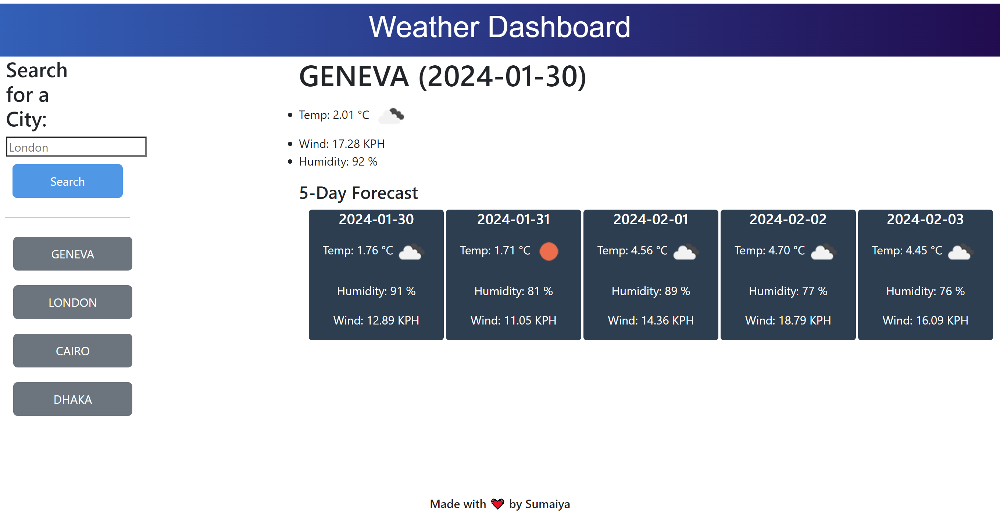

# Weather Dashboard
Enabling travellers to search cities and getting 5 day weather forecast so that they can plan their trips accordingly.

## Description
The purpose of this project is to enable users to search current and future 5 day forecast of cities of their choice.This application uses [Open Weather API](https://openweathermap.org/forecast5) to create a user friendly dashboard for travellers to plan their trips.

## Table of Contents 
- [Installation](#installation)
- [Features](#features)
- [Credits](#credits)
- [License](#license)

## Installation
Click this link for accessing the Weather Dashboard Application:
https://sumzulfikar.github.io/Weather_Dashboard/

Below is screenshot of the application:

## Features
The Weather Dashboard application.
1. Enter city name in the searchbox
2. The Current weather and next 5 day forecast of tempreture, humidity and wind will appear
3. Everytime user enters a city name that city is stored in the application so that the user can click the previous searches  buttons and access latest weather details on those cities easily.
4. The previous 4 searches will appear on the application even it the user refreshes the webpage.
5. Each weather details shows appriopiate weather icon for better visualization.

## Credits
- Reading the API documentation and discussing with my classmates was super helpful. Bootcamp xpert, w3c and mdn webdocs were great resources,

## License
MIT License

## Badges

## Tests
Acceptance Criteria met.

